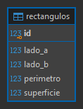

# Ejercicio 1: Rectángulos

API REST en Express y MySQL 8.0 o superior. Los `POST` y `PUT` aceptan exclusivamente `ladoA` y `ladoB`; el servidor calcula perímetro (`2 × (ladoA + ladoB)`) y superficie (`ladoA × ladoB`) antes de guardar. Se admiten lados numéricos mayores que cero, hasta 1.000.000 y con un máximo de cuatro decimales. `DECIMAL` evita aproximaciones de coma flotante en la persistencia.

## Preparación

1. Crear la base ejecutando `schema.sql` en MySQL.
2. Copiar `.env.example` a `.env` y completar las credenciales.
3. Ejecutar `npm install` y `npm run dev`.

## API

| Método | Recurso | Respuesta |
|---|---|---|
| GET | `/rectangulos?limit=50&offset=0` | 200, lista paginada |
| GET | `/rectangulos/:id` | 200 o 404 |
| POST | `/rectangulos` | 201 |
| PUT | `/rectangulos/:id` | 200 o 404 |
| DELETE | `/rectangulos/:id` | 204 o 404 |

Las entradas se validan con `express-validator`; los errores de entrada responden 400. Las consultas SQL son parametrizadas. Los identificadores deben ser enteros positivos; `limit` va de 1 a 100 y `offset` es no negativo. No se aceptan claves extra en el cuerpo ni en la consulta.

## Diagrama entidad-relación

La tabla almacena los valores derivados para que las consultas no tengan que recalcularlos; la API es la única responsable de generarlos y no confía en valores calculados por el cliente.