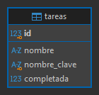

# Ejercicio 2: Tareas

API REST con Express y MySQL para crear, consultar, modificar y eliminar tareas. Una tarea nueva queda pendiente si se omite `completada`.

## Preparación

1. Ejecutar `schema.sql` en MySQL.
2. Copiar `.env.example` a `.env` y completar las credenciales.
3. Ejecutar `npm install` y `npm run dev`.

## API

| Método | Recurso | Respuesta |
|---|---|---|
| GET | `/tareas?estado=pendiente&limit=50&offset=0` | 200, lista filtrada/paginada |
| GET | `/tareas/:id` | 200 o 404 |
| POST | `/tareas` | 201 o 409 por nombre repetido |
| PUT | `/tareas/:id` | 200, 400, 404 o 409 |
| DELETE | `/tareas/:id` | 204 o 404 |

El nombre se compara ignorando mayúsculas/minúsculas y espacios exteriores; los acentos sí distinguen nombres. La API recorta el texto, deriva `nombre_clave` en servidor y un índice `UNIQUE` en MySQL garantiza la regla incluso ante solicitudes simultáneas. La consulta `estado` admite exclusivamente `pendiente` o `completada`. Parámetros, consultas y cuerpo se validan con `express-validator`; el cuerpo no admite campos extra y el estado requiere un booleano JSON.

## Diagrama entidad-relación

Una sola tabla representa el recurso independiente tarea; `nombre_clave` es una clave técnica única derivada para imponer el criterio de comparación elegido.