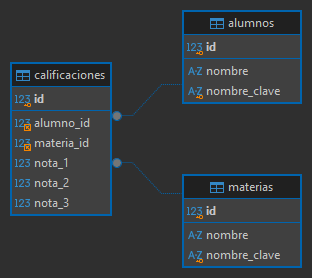

# Ejercicio 3: Calificaciones

API REST en Express y MySQL para administrar alumnos, materias y sus calificaciones. Las notas usan escala de 0 a 10 inclusive, admiten hasta dos decimales y se reciben como un arreglo de exactamente tres números.

## Preparación

1. Ejecutar `schema.sql` en MySQL.
2. Copiar `.env.example` a `.env` y completar las credenciales.
3. Ejecutar `npm install` y `npm run dev`.

## API

| Recurso | Métodos |
|---|---|
| `/alumnos` y `/alumnos/:id` | GET, POST, PUT, DELETE |
| `/materias` y `/materias/:id` | GET, POST, PUT, DELETE |
| `/calificaciones` y `/calificaciones/:id` | GET, POST, PUT, DELETE |

La lista de calificaciones permite filtrar por `alumnoId` o `materiaId` y paginar con `limit` (1–100) y `offset` (no negativo). Los nombres se comparan sin distinguir mayúsculas/minúsculas y sin considerar espacios exteriores; los acentos sí distinguen. El servidor deriva las claves normalizadas. Las reglas se validan con `express-validator`, se comprueba la existencia del alumno y la materia y los índices `UNIQUE` en MySQL cierran posibles carreras concurrentes.

Los registros de calificaciones referencian alumnos y materias mediante claves foráneas. Eliminar un alumno elimina sus calificaciones (`CASCADE`); una materia con calificaciones no puede eliminarse (`RESTRICT`). El índice único compuesto impide repetir la combinación alumno–materia tanto al crear como al modificar.

## Diagrama entidad-relación

